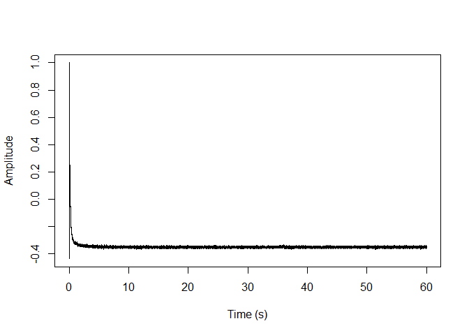
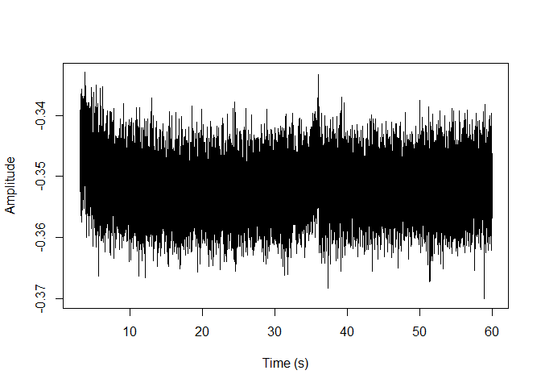
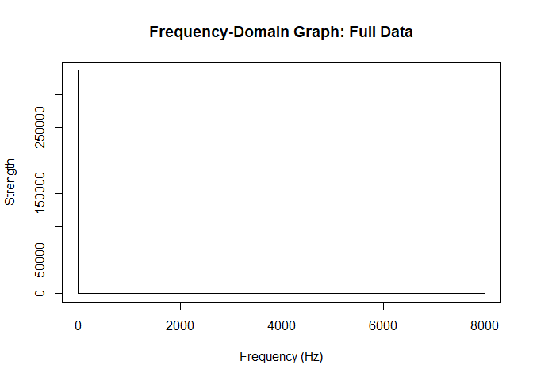
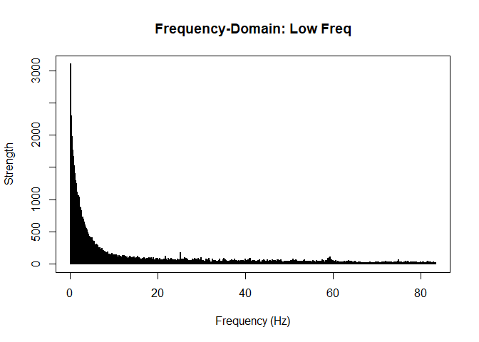
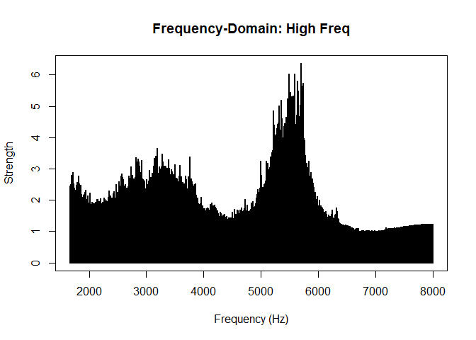
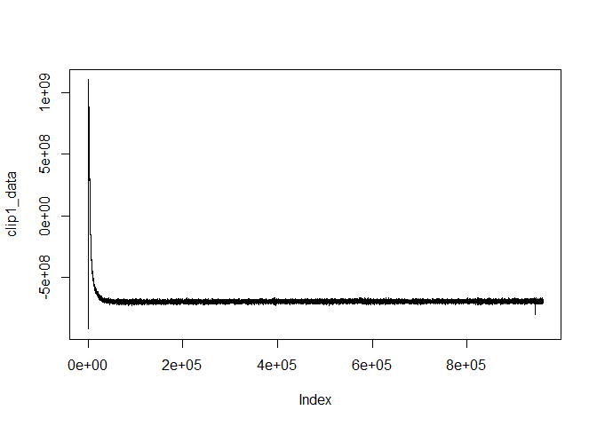
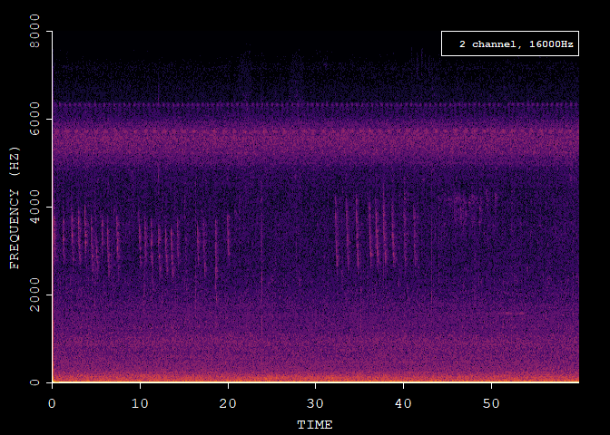

    library(audio)
    library(readr)
    library(tuneR)

    ## 
    ## Attaching package: 'tuneR'

    ## The following object is masked from 'package:audio':
    ## 
    ##     play

    library(av)

    ## 
    ## Attaching package: 'av'

    ## The following object is masked from 'package:tuneR':
    ## 
    ##     sine

\#Load Audio File

    adat<-load.wave("audio2020-08-18-08_00_01.wav")

    # This is a stereo recording. Convert to mono for simplicity

    y<-adat[1,] + adat[2,]

    #path of file
    file_audio_path <- "audio2020-08-18-08_00_01.wav"
    #Read Files
    train_audio = readWave(file_audio_path)
    #Lets see the structure of the audio.
    str(train_audio)

    ## Formal class 'Wave' [package "tuneR"] with 6 slots
    ##   ..@ left     : int [1:960000] 0 0 0 0 0 268167993 2147483647 -672045900 -672154295 -672262689 ...
    ##   ..@ right    : int [1:960000] 0 0 0 0 0 1183125967 61351287 -591075209 -591291998 -591508787 ...
    ##   ..@ stereo   : logi TRUE
    ##   ..@ samp.rate: int 16000
    ##   ..@ bit      : int 32
    ##   ..@ pcm      : logi TRUE

\#Plot Time-Domain Graph

    s1 <- train_audio@left
    s1 <- s1 / 2^(train_audio@bit -1)
    timeArray <- (1:(960000)) / train_audio@samp.rate
    #Plot the wave
    plot(timeArray, s1, type='l', col='black', xlab='Time (s)', ylab='Amplitude')

    plot(timeArray[50000:960000], s1[50000:960000], type='l', col='black', xlab='Time (s)', ylab='Amplitude')

\#FFT (DFT) on Audio Data

    X.k <- fft(s1)                   # get amount of each frequency k
    time     <- 60                            # measuring time interval (seconds)
    acq.freq <- 16000                          # data acquisition frequency/ sampling rate (Hz)

    ts  <- seq(0,time-1/acq.freq,1/acq.freq) # vector of sampling time-points (s) 

\#Plot Frequency-Domain Graph (after FFT)

    # generate x-axis with frequencies
    x.axis <- 1:(length(X.k)/2) * acq.freq/length(X.k) #So for each actual frequency in the signal, fft() will give 2 peaks (one at the "actual" frequency and one at sampling frequency minus "actual" frequency), making the second half of the magnitude vector a mirror image of the first half.As long as the sampling frequency was at least twice as high as the expected signal frequency, all "meaningful" information is contained in the the first half of the magnitude vector.
    plot.data  <- cbind(x.axis, Mod(X.k))
    xlimits=c(0,length(X.k)/2)
      
    plot(plot.data[1:(length(X.k)/2), ], t="h", lwd=2, main="Frequency-Domain Graph: Full Data", xlab="Frequency (Hz)", ylab="Strength")

    plot(plot.data[2:5000, ], t="h", lwd=2, main="Frequency-Domain: Low Freq", xlab="Frequency (Hz)", ylab="Strength")

    plot(plot.data[100000:480000, ], t="h", lwd=2, main="Frequency-Domain: High Freq", xlab="Frequency (Hz)", ylab="Strength")

 \#Plot
Spectrogram

    clip1 <- "audio2020-08-18-08_00_01.wav"
    av_media_info(clip1)

    ## $duration
    ## [1] 60
    ## 
    ## $video
    ## NULL
    ## 
    ## $audio
    ##   channels sample_rate     codec frames bitrate     layout
    ## 1        2       16000 pcm_s32le     NA 1024000 2 channels

    clip1_data <- read_audio_bin(clip1, channels = 1, end_time = 60.0)
    plot(clip1_data, type = 'l')

    # Read data and directly transform to frequency
    fft_data <- read_audio_fft(clip1, end_time = 60.0)

    # Plot the spectrogram
    plot(fft_data)

